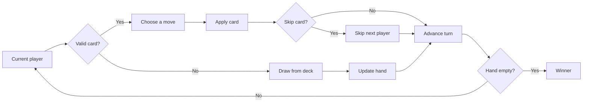

<div align="center">

<h1>🃏 UNO — Minimax vs Expectimax</h1>

<h3>A 3-player UNO simulation for comparing defensive and probability-aware AI search strategies</h3>

<p>
  
  
  
  
  
</p>

<p>
A simplified UNO environment built to compare how <strong>Minimax</strong> and <strong>Expectimax</strong> behave when the same game contains both adversarial decisions and random card draws.
</p>

</div>

---

## 🌐 Live Demo

[**Play the Game →**](https://uno-3-player-a-ivs-human.vercel.app/)

> An interactive web version of the UNO game featuring a human player against AI opponents, with a browser-based interface for gameplay.

## 🎮 Game Overview

This project models a three-player version of UNO in which each player follows a different decision strategy.

- **Player 1** uses defensive Minimax with alpha-beta pruning
- **Player 2** uses offensive Expectimax
- **Player 3** can either be controlled by the user or run as another Minimax agent
- every player starts with **5 cards**
- a card is playable when its **colour or value** matches the current top card
- `Skip` cards remove the next player from the upcoming turn
- if no legal move exists, the player draws from the deck
- the first player to empty their hand wins

The implementation deliberately uses a smaller UNO ruleset so the focus stays on **search, heuristics, chance modelling, and algorithm comparison**.

### 🂠 Simplified Deck

The deck contains **44 cards**:

| Card type | Per colour | Total |
|---|---:|---:|
| Number cards `0–9` | 10 | 40 |
| `Skip` | 1 | 4 |
| **Total** | **11** | **44** |

The game uses four colours: **Red, Blue, Green, and Yellow**.

> Wild, Reverse, Draw Two, and Draw Four cards are intentionally not part of this implementation.

### 🔄 Turn Flow



---

## 🤖 AI Players

The interesting part of the project is that the agents are **not trying to play in exactly the same way**. Their search algorithms and evaluation functions intentionally encourage different behaviour.

### 🛡️ Player 1 — Defensive Minimax

Player 1 uses **Minimax with alpha-beta pruning** and assumes that opponents will choose moves that are worst for the evaluating player.

Its evaluation function is:

```text
50 - 6(CAI) + 2(Copp) + 4(S)
```

where:

- `CAI` — cards remaining in the AI player's hand
- `Copp` — average number of cards held by the two opponents
- `S` — Skip cards held by the AI

This strategy penalizes its own hand size heavily and places extra value on keeping Skip cards available for defensive play.

### ⚡ Player 2 — Offensive Expectimax

Player 2 uses **Expectimax**. Instead of treating every uncertain outcome as an adversarial worst case, it calculates expected values across possible outcomes.

Its evaluation function is:

```text
50 - 5(CAI) + 3(Copp) + 2(S)
```

Compared with the defensive agent, this strategy:

- places more weight on increasing opponents' hand sizes
- places slightly less value on holding Skip cards
- explicitly models uncertainty when a card must be drawn

### 🎲 Chance Nodes

When Player 2 has no legal card, the draw is represented as a **chance node**.

The program counts the card types currently remaining in the deck and evaluates each possible draw using its exact frequency:

```text
P(card) = occurrences of card / cards remaining in deck
```

The resulting state values are combined into an expected score rather than selecting only the best or worst draw.

### 👤 Player 3 — Human or Minimax

Player 3 depends on the selected mode:

| Mode | Player 3 |
|---|---|
| **Manual** | Human-controlled |
| **Simulation** | Defensive Minimax |

This makes it possible to both **play against the two AI strategies** and run fully automated experiments.

---

## 🧠 Search & Decision Making

Both AI searches currently use a **depth of 3** when selecting moves.

### Minimax Search

For Player 1 and simulated Player 3:

- the AI's own turn is treated as a `MAX` node
- opponent turns are treated as `MIN` nodes
- terminal wins/losses receive large positive/negative scores
- depth-limited leaves use the defensive heuristic
- alpha-beta pruning stops exploring branches that cannot affect the final decision

### Expectimax Search

For Player 2:

- its own turn is a `MAX` node
- opponent actions are averaged as expected outcomes
- forced draws can create explicit `CHANCE` nodes
- chance branches are weighted by card probabilities in the remaining deck
- depth-limited leaves use the offensive heuristic

### Search Tree Visualization

The notebook also builds `TreeNode` objects and includes custom console renderers for inspecting generated search trees. A fixed `tree_demo()` scenario is included so Minimax and Expectimax can be compared on the same game state.

---

## 🧪 Running the Experiments

The notebook exposes three choices from its main menu.

| Option | Mode | What it does |
|---:|---|---|
| `1` | Simulation | All three players are AI-controlled |
| `2` | Manual | You control Player 3 against Minimax and Expectimax |
| `3` | Comparison | Runs a batch of AI-only games and compares winners |

In the current notebook, comparison mode calls:

```python
compare_algorithms(n_games=50, randomize=False)
```

so the default comparison uses **50 deterministic seeded games**. The helper can also be called with `randomize=True` to test changing random seeds.

### Why Compare Both Algorithms?

UNO combines two different types of uncertainty:

- **adversarial decisions** — other players choose their own moves
- **random outcomes** — drawing from a shuffled deck is uncertain

Minimax is naturally suited to adversarial planning, while Expectimax is designed to incorporate probabilistic outcomes. This project uses the same game environment to show how those two assumptions can lead to different choices.

---

## 📊 Complexity

Let:

- `b` — average number of legal actions at a search node
- `d` — search depth
- `c` — number of distinct possible card outcomes at a chance node
- `h` — number of cards in a player's hand
- `D` — number of cards remaining in the deck

| Operation | Approx. Complexity |
|---|---:|
| Find valid moves | `O(h)` |
| Apply a move | `O(state size)` due to deep copying |
| Minimax, worst case | `O(b^d)` |
| Alpha-beta, ideal ordering | `O(b^(d/2))` |
| Count draw probabilities | `O(D)` |
| Expectimax | Exponential in search depth; chance nodes can add up to `c` branches |

With the current search depth fixed at `3`, the trees remain manageable for this simplified deck, although the cost can still grow quickly when hands contain several valid moves.

> The implementation prioritizes making the search process easy to inspect and compare rather than aggressively optimizing state copying or tree construction.

---

## 🛠️ Tech Stack

| Technology | Role in the Project |
|---|---|
| **Python** | Game state, card logic, search algorithms, simulation |
| **Jupyter Notebook** | Interactive execution, experiments, analysis, and demonstrations |
| **Minimax** | Defensive adversarial search |
| **Alpha-Beta Pruning** | Reduces unnecessary Minimax branches |
| **Expectimax** | Probability-aware offensive search |
| **Python standard library** | Randomization, deep copying, and captured simulation output |

The game logic itself only imports standard-library modules such as `random`, `copy`, `io`, and `contextlib`.

---

## 🚀 Getting Started

### 1. Clone the Repository

```bash
git clone https://github.com/fizzahussain/UNO-3Player-AIvsHuman.git
cd UNO-3Player-AIvsHuman
```

### 2. Open the Notebook

The project is contained in:

```text
game.ipynb
```

You can open it using **Jupyter Notebook**, **JupyterLab**, or the Jupyter extension in **VS Code**.

If Jupyter is not installed:

```bash
python -m pip install notebook
```

Then launch:

```bash
jupyter notebook game.ipynb
```

### 3. Run the Cells

Run the notebook cells from top to bottom. When the menu appears, select:

```text
1  Simulation Mode
2  Manual Mode
3  Algorithm Comparison
```

For Manual Mode, you play as **Player 3** and choose from the valid cards displayed in the terminal/notebook output.

---

## 📁 Project Structure

```text
UNO-3Player-AIvsHuman/
├── game.ipynb          # Game implementation, AI algorithms and analysis
├── .gitignore
├── .gitattributes
├── README.md
└── docs/
    └── TECHNICAL.md    # Detailed algorithm and implementation notes
```

---

## 🔍 Technical Documentation

For a deeper look at the state representation, Minimax recursion, alpha-beta pruning, Expectimax chance nodes, heuristic design, and simulation workflow, see:

### 📘 [Technical Documentation](docs/TECHNICAL.md)

---

## 📌 Project Background

This project explores **adversarial search and decision-making under uncertainty** through a simplified version of UNO. Instead of using a single AI strategy for every player, it gives the agents different objectives and search assumptions so their behaviour can be compared in the same environment.

The result is both a playable 3-player card game and a small experimental framework for examining **Minimax, alpha-beta pruning, Expectimax, heuristic evaluation, chance nodes, and turn-order effects**.
